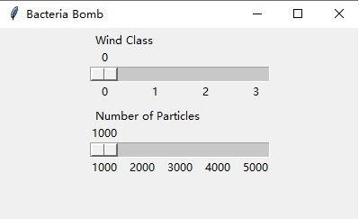
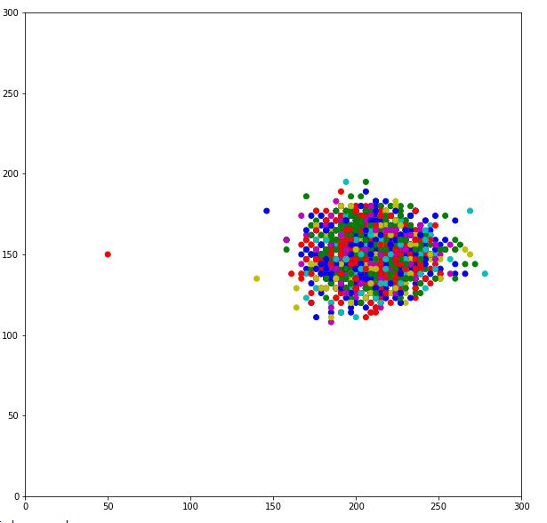
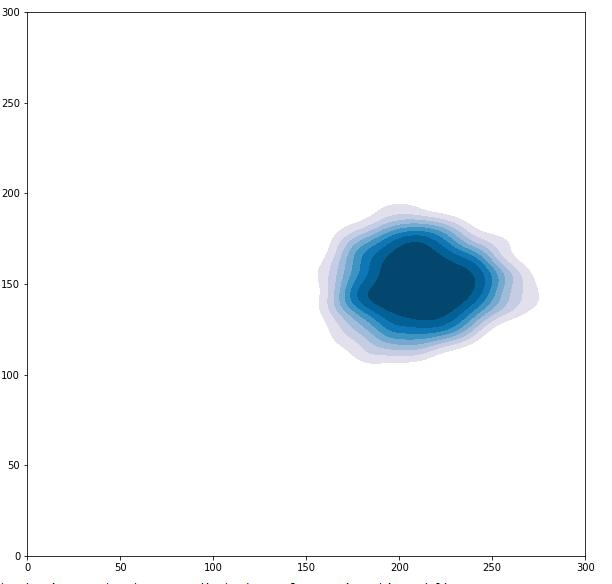

# Assignment2-pythonstudy
This is an assignment for geography programming course

# A Brief Introduction to the Model.
This model is called Bacteria Bomb, which is about how bacteria spread in the air.
The hypothetical scenario is that someone lets off a biological weapon on the top of a 75-meter-high building, and the bacteria particles will spread with the wind in the air. Affected by wind, those particles have a 5% chance to move west, a 75% chance to move west and 10% chance to move south or north. The greater the wind speed, the farther the particles move. These particles are also affected by turbulence, and they have a 20% chance to rise by a metre, a 10% chance to stay at the same level and a 70% chance to fall when their height is greater than 75 metres, while when they are below 75 metres, they will drop by a metre a second.  
For more information please refer to the Read_me document.

# How the model works
This model provides two scrollbars to adjust the wind speed and the number of particles 

Wind Class Scrollbar

This scrollbar allows you to adjust the wind speed before running the model, the particle will move one pixel a second in the first wind class, two pixels a second in the second wind class and three pixels in the third pixels.

Number of Particles Scrollbar

This scrollbar allows you to adjust the quantity of the bacteria particles, you can adjust the number of particles from 1000 to 5000.

Scatter Plot and densityof Particles

After you adjust the scrollbars, all of the particles will move and their final coordinates will be saved as a text file. The scatter plot (Fig.2) of particles’ position will appear in the Console window (it may not appear immediately due to large quantity of calculations), and the figure will be saved as a jpg picture. Every time you adjust the scrollbar the scatter plot will be renewed automatically and the jpg also will be saved as the latest picture.

Density Map of Particles

The density map (Fig.3) of particles’ distribution will appear in the Console window after you close the scrollbar window, the density map will also be saved as a jpg picture and update automatically when the scrollbars change.  

# Problems or Bugs you may encounter

(1)	This model has only been tested in Spyder, and may not work as expected in other environments

(2)	Before you run this model in spider please set the backend to ‘Inline’, otherwise you will get a lot of picture windows. Tools → Preference → IPython console → Graphics → Backend: Inline

(3)	When you run the model first for the first time, two GUI windows should appear, please adjust the scrollbars from the ‘Bacteria Bomb’ window, which is a bigger window, and just ignore another small window.

(4)	You may get stuck or uncontrolled when you adjust the scrollbar. Please wait patiently for a few seconds and slowly move the slider, and it would be better to adjust the wind class by clicking instead of dragging the scrollbar.

(5)	When the wind speed is fast or there are too many particles, an index exceeding limit error may occur. In this case, please adjust the scrollbar to run again.

(6)	The image may not appear in the window immediately, sometimes you need to wait a little longer

(7)	The saved picture may not be the same as the picture displayed in the Console window due to changes in the coordinate axes.

# License	
For more information about the license, please refer to the LICENSE file.

# Code Test
For more information about the code test, please refer to the Code_Test file.

Appreciate for everyone who may read this document and run this model.

@author: FUGANGZHOU

